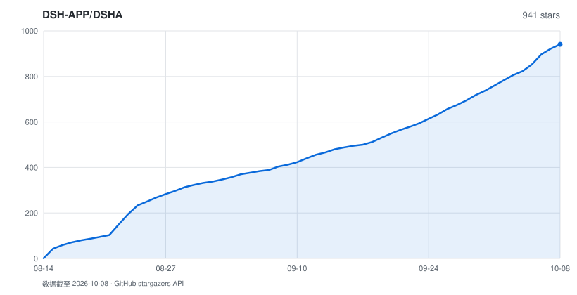

# DSHA

<p align="center">
  <b>DeepSeek Harness 安卓启动器</b><br>
  在手机上跑完整的 <a href="https://github.com/deepseek-ai/deepseek-harness">deepseek-harness</a> —— 免 ROOT，免 Termux，装完即用
</p>

<p align="center">
  <a href="LICENSE"></a>
  <a href="https://github.com/DSH-APP/DSHA/releases/latest"></a>
  <a href="https://github.com/DSH-APP/DSHA/stargazers"></a>
  
  
  <a href="https://afdian.com/a/dsha_apk"></a>
  <a href="https://qm.qq.com/q/N5aZSlnmgM"></a>
</p>

<p align="center">
  <a href="README.en.md">English</a> · <b>简体中文</b> · <a href="https://dsha.cc">官网 dsha.cc</a> · <a href="CHANGELOG.md">更新记录</a> · <a href="docs/security-model.md">安全模型</a> · <a href="AGENTS.md">AGENTS.md（给 AI / 开发者）</a>
</p>

> 🤖 下一个 AI / 开发者请先读 **[AGENTS.md](AGENTS.md)**（项目结构、启动契约、踩过的坑），不要先全库扫描。

## ❤️ 赞助商

<table>
<tr>
<td width="180"><a href="https://zdxjl.com/register?aff=WDYTNDJ5LT4X"></a></td>
<td>感谢 <a href="https://zdxjl.com/register?aff=WDYTNDJ5LT4X">绿萝中转站</a> 赞助本项目！绿萝中转站是一个包含多种厂家模型的 AI 平台，多款主流大模型随开随用，写代码、生成图片等等都能在同一平台调用。国内外模型应有尽有，上新及时，服务周到，价格美丽。使用本链接注册可享受充值 105% 优惠。</td>
</tr>
</table>

<table>
<tr>
<td width="180"><a href="https://ai.onyxaxis.org/"></a></td>
<td>感谢 <a href="https://ai.onyxaxis.org/">Axis AI</a> 赞助本项目！Axis AI 是一个免费的公益 AI 平台，多款主流大模型随开随用，聊天、写代码、生成图片都能在同一平台内实现。</td>
</tr>
</table>

---

## 这是什么

DeepSeek Harness（`@deepseek-ai/dsh`）是 DeepSeek 官方的 agent harness，类 Claude Code。
它是为 glibc Linux 写的，直接在安卓上跑会撞上一堆事：原生模块编译不过、`link(2)` 被
SELinux 挡住、沙箱起不来、前端按桌面布局排版。

**DSHA 把这些全部封在一个 APK 里。** 装 APK、填 API key（或跳过）、点启动 —— 不需要 Termux、
不需要 ROOT、不需要敲一行命令。里面是一个完整的 Ubuntu 环境：`apt` 能用、
交互式 PTY 能用、需要编译的原生模块能装，跟你在服务器上用是同一套东西。

由贡献者 [@ym2025szz](https://github.com/ym2025szz) 维护并发布，感谢原作者
[@qiannianhuanxiang](https://github.com/qiannianhuanxiang) 和其他贡献者。

---

## 下载

当前正式版 **v0.1.7-rc2**（[发布说明](https://github.com/DSH-APP/DSHA/releases/tag/v0.1.7-rc2) ·
[完整更新记录](CHANGELOG.md)），两个版本共享 `com.dsh.client` 包名与数据，**不能并排安装**：

| 版本 | 适用设备 | 内核 | 下载 | 大小 |
|---|---|---|---|---:|
| **Standard 标准版** | Android 11+ / arm64 | 系统 WebView；支持实验性虚拟屏 | [APK](https://github.com/DSH-APP/DSHA/releases/download/v0.1.7-rc2/dsha-0.1.7-rc2.apk) · [SHA-256](https://github.com/DSH-APP/DSHA/releases/download/v0.1.7-rc2/dsha-0.1.7-rc2.apk.sha256) | 261 MiB |
| **Low 兼容版** | Android 6+ / arm64 | 内置 GeckoView 143；暂不支持虚拟屏 | [APK](https://github.com/DSH-APP/DSHA/releases/download/v0.1.7-rc2/dsha-0.1.7-rc2low.apk) · [SHA-256](https://github.com/DSH-APP/DSHA/releases/download/v0.1.7-rc2/dsha-0.1.7-rc2low.apk.sha256) | 334 MiB |

- **升级**：用同签名 APK 覆盖安装即可（证书指纹 `e7e3a3…a53f5`，验装方法见[安全模型](docs/security-model.md)）。相同 Ubuntu 基础版本只更新受管组件，不重建整个环境。
- **应用内更新**：「设置 → 检查更新」从官网 [`dsha.cc`](https://dsha.cc) 拉取发布清单，无需盯 Releases。
- **历史版本**：[Releases](https://github.com/DSH-APP/DSHA/releases)。

### 30 秒上手

1. 装 APK（仅 arm64；Android 11+ 选 Standard，更老的系统选 Low）
2. 首次启动解压内置环境（几分钟，只有一次）
3. 「配置」页填 DeepSeek API key →「启动」页点启动 → 自动打开 Web UI

就这样。想跑得更细可以走「分步安装」，每步都能单独重装、单独更新。

---

## 为什么是 DSHA

|  | 说明 |
|---|---|
| 🚫 **零命令行门槛** | 内置离线 Ubuntu rootfs，APK 装完就能用。不装 Termux、不配 pkg、不敲命令 |
| 🐧 **完整 glibc 环境** | 不是裁剪版：`apt` / PTY / 原生模块 / Python / git 都在。上游插件不用改就能跑 |
| ⚡ **proroot 零 ptrace 开销** | 传统 proot 每个系统调用两次上下文切换；proroot 走 LD_PRELOAD + 二进制补丁做进程内路径翻译。真机实测关键项合计 **+58%** |
| 🔌 **手机就是 agent 的手** | 无障碍 + ADB 免 Shizuku 直连 + 独立虚拟屏：读屏、点按、装应用、跑自动化，全部内置 |
| 💾 **卸载重装数据不丢** | 对话与设置放在 `Documents/dshdata`，文件管理器里可见可备份；API key 走 Android Keystore 加密 |
| 🩺 **坏了能自己说清哪坏了** | 组件级自检 + 按需修补 + 启动诊断 + 独立应急 DSH；Web 起不来时直接点名是哪个插件 |

---

## 核心模块

### ① 装机与环境

| 能力 | 说明 |
|---|---|
| 内置离线 rootfs | Ubuntu 24.04 (noble) arm64 打进 APK，无网也能完成环境部署 |
| 六步安装流水线 | 解压 → 基础工具 → Node.js → pnpm → dsh → 补丁，每步先探测再执行、装完即校验；只修失败项，不从头重来 |
| 分步重装 / 更新 | rootfs、工具、Node、harness 相互独立，可单独重装，不重复下载 |
| 双装机路径 | 预构建包与源码构建都支持，源码路径自动处理 node-pty 等原生模块编译 |
| 离线工具链 | curl / git / Python / 证书随包锁定版本（`packages.lock.json`），不依赖用户先跑 `apt` |
| 镜像与网络 | apt 源官方 / 中科大镜像自动回退；DNS 三模式（auto / 强制 IPv4 / 系统原生），AAAA 被拒时仅重试解析、不重放 HTTP 请求 |
| 基础环境版本化 | Ubuntu 基础环境独立编号；界面更新不重建环境，普通 dsh 更新不递增基础版本 |

### ② 运行时

| 能力 | 说明 |
|---|---|
| proroot / proot 双运行时 | 默认 proroot（零 ptrace 开销），「配置」页一键切回 proot |
| 实测提升 | vivo V2352A / Android 14：关键项合计 +58%，tar 打包 +94%（备份走这条），stat 密集 +82%（node 模块解析） |
| 三层兜底 | 运行时文件缺失自动降回 proot；连续 3 次启动失败强制切回并告知；装机路径始终用 proot |
| Node.js 24 + pnpm 10 | 与上游一致的运行环境，随包锁版本 |
| 分包更新 | Ubuntu 与 dsh 运行时在 APK 内分包；冷安装两份都解压，局部更新只读 dsh 包 |
| 受管更新试运行 | 新环境先在隔离区真实启动、验证端口 / 鉴权 / 会话读写 / 插件加载，全过后才切换提交，失败自动回切 |
| 前台服务 + 看门狗 | 通知栏可见运行状态；Web 掉了自动拉起，不用手动重启 |
| 慢启动保护 | 等待鉴权不设强杀时限（60 秒仅提示），看门狗不会把慢启动当故障误杀 |

### ③ 数据与备份

| 能力 | 说明 |
|---|---|
| 数据不随卸载消失 | 会话 / 设置 / 附件放 `内部存储/Documents/dshdata`，原位留私有软链 |
| v5 加密备份 | `.dshbak` 密码派生密钥 + AES-GCM，先完整认证再预检；备份前预览「多少内容 / 多大 / 来自哪个版本」 |
| 自动备份计划 | 默认开启：每天指定时间 / 每隔 1–168 小时 / 停止 DSH 后，三种模式；运行中自动延后不打断工作；保留最近 3 份已验证副本 |
| 分范围备份 | 全量 / 只对话 / 只插件 / 只设置任选，恢复时只覆盖对应内容 |
| 换机不丢对话 | 对话等热数据是指向公开目录的软链，备份会额外解引用快照；跨设备的链接路径恢复时自动重写 |
| 凭据不进备份 | 桥 token 整文件排除；`.credentials.yaml` 字段级剔除本机密钥、保留用户 API key |
| 恢复极宽容 | 老备份一律放行；缺失插件后台自动补装；系统插件由当前 APK 按受管清单重建、不占备份体积 |
| 会话损坏隔离 | 坏掉的会话文件挪到 `corrupt-backup` 可取回，不让一个坏文件卡住整个 Web |
| 覆盖更新自动清理 | 升级后闲时清理可再生缓存与多余旧副本；保留至少两份健康前代，改过的原件不动 |
| 完整格式化 | 核心数据严格删除并复核；仅 WebView 缓存等可重建目录允许降级警告 |

### ④ 设备能力（让 agent 真正操作这台手机）

agent 通过本机 `127.0.0.1:3090` 桥调用以下能力（token 门控，`/app/help` 有完整端点清单）：

| 能力 | 说明 |
|---|---|
| 屏幕操作 | **无障碍服务实现，不需要 ADB**：读屏结构化输出（带可点击区域坐标）、按文字 / 坐标点按、输入、按键、滑动、截屏存 PNG |
| 独立虚拟屏（实验） | Standard 版 Android 11+：创建虚拟屏、启动任意已装应用、抓最新帧（操作须携带帧号校验防错位）、点按 / 滑动 / 输入 / 按键 |
| ADB 无线直连 | 内置无线配对（TLS 1.3-PSK + SPAKE2）与保活，**不需要 Shizuku**，重启手机自动恢复 |
| Shizuku / Root 通道 | 备用设备命令通道，与 ADB 同受命令白名单约束 |
| 与用户交互 | 系统通知、App 内提示、震动（长任务叫醒用户）、弹窗三选项征询、分享 / 打开链接 |
| 文件交换 | 读目录 / 文本文件、导出产物到 `Download/DSHA`；凭据区（`.dsh` / `.ssh` / `.android`）读写均被拒绝 |
| 传感器与位置 | 光线 / 加速度 / 陀螺仪 / 磁力计 / 气压 / 步数 / 定位 / 手电筒 —— 默认关闭，逐项授权 |
| 剪贴板 | 读写剪贴板（受系统前台限制） |
| 危险命令守门人 | 设备命令始终走白名单解析：格式化 / 分区 / SELinux / 系统属性等直接拒绝；不认识的命令不放行；拦截返回 `[POLICY_BLOCKED]` 而不是弹「仍然允许」 |
| 短信读取 | 独立敏感能力，仅限严格只读查询，默认每条确认，授权可撤销、不随备份迁移 |

### ⑤ 终端

| 能力 | 说明 |
|---|---|
| 真 PTY 终端 | Termux terminal-emulator JNI 实现：vim / htop / tmux 等全屏 TUI 可用 |
| 手机键盘补偿 | 扩展键行（Ctrl / Alt / Esc / 方向键 / Tab），双指缩放调字号 |
| 多标签 | 多会话并存，跨切页 / 旋转 / 语言切换保持进程与状态 |
| 简易终端兜底 | PTY 在个别机型异常时可切回简易终端，会话保留在后台 |

### ⑥ Web UI 与访问

| 能力 | 说明 |
|---|---|
| 双内核 | Standard 用系统 WebView；Low 内置 GeckoView 143，不受系统 WebView 版本拖累 |
| 移动端适配 | 内置 [dsh-web-mobile](https://github.com/mexiaosqwq/dsh-web-mobile)（MIT）：窄屏单栏 + 目录抽屉、底部 sheet、安全区适配 |
| 画中画 | 对话窗口支持 PiP 小窗悬浮 |
| 高刷与省电 | 按用户刷新率上限请求高刷（实测 120 Hz 零掉帧）；空闲自动交还系统省电 |
| 深浅色与多语言 | 深色 / 浅色 / 跟随系统；简体中文 / English，默认跟随系统语言 |
| 局域网访问 | 电脑 / 平板浏览器直接用手机上的 dsh。token 鉴权 fail-closed，命中后回设 `SameSite=Strict` Cookie，不让 token 随外链泄漏 |
| 老浏览器兼容 | 自动注入 `AbortSignal.any/timeout` 与 `crypto.randomUUID` polyfill（局域网 HTTP 下必需） |
| 流式悬浮条 | AI 输出像歌词一样贴在屏幕顶部，工具调用翻译成人话；底色 / 透明度 / 行数可调；危险命令可直接在悬浮条上批准 |
| 端口可配 | Web 端口自定义，冲突自动回退并说明 |

### ⑦ 插件生态

| 能力 | 说明 |
|---|---|
| 插件市场 | 安装 / 更新 / 启停 / 删除 / 搜索 / 排序，全在 App 内；配合官网 [dsha.cc](https://dsha.cc) 插件目录与社区插件 |
| 多样安装方式 | GitHub 简写 / tree / blob / archive / Release 链接、HTTPS 压缩包直链、本地导入（按内容识别格式）、终端 `dsha-plugin install` |
| 多下载源 | 自动择源，支持 npm 官方源与 npmmirror，更新检查多路并发、锁定版本复用缓存、失败有限回退 |
| 依赖安全 | 随包 pnpm 原生锁冻结依赖摘要；禁用生命周期脚本与 pnpmfile 钩子；压缩包越界路径 / 包外软链拒绝 |
| 先审阅后启用 | 第三方插件安装后保持停用，静态结构 + 内容摘要核对，由用户确认后才启用 |
| 硬依赖自动改造 | 插件写死的服务依赖就地改成运行时注入 —— 一个插件不拖挂整棵插件树 |
| 内置插件保护 | 内置插件不可删除；用户禁用过的，升级后保持禁用；配置可导入导出 |

内置 7 个插件：`dsh-web-mobile`（移动端适配）、`dsh-status-overlay`（悬浮条）、
`dsh-task-notifier`（回合完成通知）、`dsh-device-shell-guide`（设备能力引导）、
`dsh-computer-use-android`（Android Computer Use）、`dsh-tool-vscreen`（虚拟屏工具）、
`dsh-auto-review`（官方实验性 Auto review 入口）。

### ⑧ 可靠性与应急

| 能力 | 说明 |
|---|---|
| 安装与修复页 | 检查全部六项组件并按需修复（证书 / npm 异常、DNS、会话写入补丁等），只处理失败项 |
| 诊断报告 | 环境检查 + 失败日志可导出；启动诊断保存阶段、实际插件错误与退出码，最近五次脱敏留存 |
| 启动恢复 | 明确的启动 / 插件故障自动进入恢复页；安全启动用独立 profile 只加载官方基础组件，原配置与插件开关保留 |
| 配置快照 | 配置变更前自动留快照（三份健康 + 三份修复前），坏了能回滚 |
| 插件故障人话诊断 | Web 起不来时直接说「是插件 X、它要的服务不存在、点这里修」，而不是甩一屏 Node 堆栈 |
| 独立应急 DSH | 正式环境损坏时进入独立应急环境：独立运行根、只读诊断先行，写入修复需原生逐步确认 |
| 脚本增量热更新 | 关键脚本可从 GitHub 增量更新并**离线验签**（公钥内置，签名不符整批拒绝），不必等新 APK |

### ⑨ 安全（默认最小权限）

| 层面 | 做法 |
|---|---|
| 什么权限都不给也能用 | 最小配置（不给 ADB、不给文件权限、不开局域网）下 DSHA 照常跑 dsh；每项能力默认关闭、随时撤销 |
| API key | Android Keystore + AES/GCM，密钥不出 Keystore；失败不清空旧密文 |
| 设备命令 | 白名单始终开启，Root / Shizuku / ADB 三通道同一套策略，应用停止前逐个核验归属，防 PID 复用误伤 |
| 桥凭据护栏 | `/app/export`、`/app/readfile` 拒绝凭据区路径，规范化 + canonical path 双重判定，堵住「软链接指凭据」的绕法 |
| 无遥测 | 不上传任何日志或使用数据；更新、插件下载、模型调用之外不发起网络请求 |
| 诚实披露 | 已知弱点（无内核级沙箱、历史明文备份、签名密钥待轮换等）在文档里直接列出 |

👉 每项权限到底暴露了什么、agent 碰得到手机的哪些部分，见 **[安全模型](docs/security-model.md)**。

---

## 与同类方案的关系

安卓上跑 dsh 目前有两条路，各有代价，说清楚比互相贴标签有用：

| | **容器派**（DSHA 走这条） | **Termux bootstrap 派** |
|---|---|---|
| 做法 | proot/proroot + 完整 glibc rootfs | 用 Termux 的包在 Android bionic 上裸跑 |
| 装机 | 装 APK 就完事 | 装 Termux → 敲命令 → 装工具链 |
| 环境 | 完整 Ubuntu，`apt` 与原生模块随便用 | 需要为 bionic 逐个打补丁 / 重编 |
| 开销 | proroot 已无 ptrace 开销 | 无容器层，理论最快 |
| 沙箱 | 两边都受限 | 两边都受限 |

---

## 已知限制

诚实列出来，省得你装完才发现：

| 项目 | 状态 | 说明 |
|---|---|---|
| 架构 | ⚠️ 仅 arm64-v8a | 32 位与 x86 设备不支持 |
| 系统 | ✅ Standard 11+ / Low 6+ | 老系统部分能力受系统限制（无线配对需 11+ 等，见 [android-low](docs/android-low.md)） |
| 包体 | ⚠️ 261 / 334 MiB | 内置完整 Ubuntu 环境的代价，换来的是免下载、免命令行 |
| bash 工具 | ✅ 可用 | 完整 Ubuntu 的 bash，agent 跑 shell 命令没有限制 |
| bash 的**沙箱隔离** | ⚠️ 不可用 | bubblewrap 要 unprivileged user namespace，Android sepolicy 不给 —— 容器派和 Termux 派都一样绕不过。约束靠 dsh 的权限档位：默认 `danger-full-access`，可在配置页改成 `workspace-write` 或 `read-only`。请自行判断风险 |
| 卓易通 / 鸿蒙 anco | ❓ 未验证 | 理论可行，尚无真机回归 |
| 悬浮条 | ⚠️ 需要授权 | 用 `TYPE_APPLICATION_OVERLAY` 自绘；免 ROOT 拿不到真正的「状态栏歌词」接口 |
| 数据位置 | ⚠️ 需要文件权限 | 「所有文件访问」被拒时数据留在私有目录，卸载即丢（自检会明确告知当前状态） |

---

## 架构

```
┌──────────────────────── APK ────────────────────────┐
│ 原生 Android（Java 17 · Material3 · 单模块 :app）    │
│  ├ 启动 / 安装修复 / 配置 / 工作区 / 插件 / 终端     │
│  ├ 网页内核：系统 WebView（Standard）/ Gecko（Low）  │
│  ├ 前台服务 + 看门狗 + 通知 + 画中画                 │
│  ├ App 桥 :3090（无障碍 / 虚拟屏 / 交互 / 文件）     │
│  ├ LAN 代理 :3081 · ADB / Shizuku / Root 设备通道    │
│  └ 悬浮条（TYPE_APPLICATION_OVERLAY）                │
├─────────────────────────────────────────────────────┤
│ proroot（默认，零 ptrace 开销）/ proot（兜底）        │
├─────────────────────────────────────────────────────┤
│ Ubuntu 24.04 arm64 · Node.js 24 · pnpm 10           │
│  └ @deepseek-ai/dsh  →  Web UI :3080                │
└─────────────────────────────────────────────────────┘
```

数据：会话 / 设置 / 附件在 `Documents/dshdata`（公开可见可备份）；
`DSH_HOME` 本体与 `.credentials.yaml` 刻意留在私有目录。

---

## ADB 无线配对（设备 Shell 能力）

配好之后 agent 就能直接操作这台手机，**不需要 Shizuku**。

**首次配对（约 1 分钟）**

1. 系统设置 →「关于手机」→ 连点「版本号」7 次开启开发者选项
2. 开发者选项 → 打开「无线调试」
3. 进入「无线调试」→「使用配对码配对设备」，记下 **IP:端口** 与 **6 位配对码**
4. 回到 DSHA →「设备能力授权」页 → 填入 → 配对

> 无线调试的配对码需要 Android 11+；老系统可走 Shizuku / Root 通道，或直接用无障碍能力（读屏、点按、输入不需要任何配对）。

**配对之后**：DSHA 自己维护连接（保活 + 重连），重启手机后也会自动恢复，不用再操作。

**验证**：内置终端里跑 `adb shell id`，输出 `uid=2000(shell)` 即成功。

**让 agent 用起来**：把技能包复制到 agent 的技能目录：

```bash
cp -r agent-skills/device-shell ~/.agents/skills/
cp -r agent-skills/screen-ocr-operator ~/.agents/skills/
```

`device-shell` 覆盖 ADB / Shizuku / Root 三通道的命令用法；
`screen-ocr-operator` 提供截屏 + OCR + 批量屏幕操作（无障碍读屏拿不到内容的 WebView / 游戏画面用）。

---

## 构建

本地构建需要 JDK 17、Android SDK（API 37）、NDK 26 与 Python 3.9+，详见 [BUILD.md](BUILD.md)：

```bash
bash build.sh                                # 默认构建 Standard Debug
bash build.sh :app:assembleLowRelease        # 构建 Low Release
bash build.sh :app:testStandardDebugUnitTest # 纯逻辑单测
python tools/verify-stability.py             # 稳定性验收门禁
```

离线 rootfs 不提交 Git；发布流程（签名、门禁、真机验收、产物替换）见 [BUILD.md](BUILD.md) 与 [docs/releases/](docs/releases/)。

---

## 文档索引

| 文档 | 内容 |
|---|---|
| [AGENTS.md](AGENTS.md) | 项目结构、启动契约、技术约束与踩坑记录（AI / 新贡献者入口） |
| [docs/security-model.md](docs/security-model.md) | 安全模型：每项权限的边界与已知弱点（[英文版](docs/security-model.en.md)） |
| [docs/plugins.md](docs/plugins.md) | 插件安装与打包要求 |
| [CHANGELOG.md](CHANGELOG.md) | 完整更新记录 |
| [docs/ROADMAP.md](docs/ROADMAP.md) | 路线图与「明确不做」清单 |
| [docs/android-standard.md](docs/android-standard.md) / [android-low.md](docs/android-low.md) | 两版设备适配说明 |
| [docs/releases/](docs/releases/) | 各版本发布与验收记录 |

## 致谢

- [deepseek-ai/deepseek-harness](https://github.com/deepseek-ai/deepseek-harness) —— 本体
- [proot](https://github.com/termux/proot) / [proroot](https://github.com/coderredlab/proroot) —— 免 ROOT 容器（见 [THIRD_PARTY_NOTICES.md](THIRD_PARTY_NOTICES.md)）
- [Termux terminal-view / terminal-emulator](https://github.com/termux/termux-app)（Apache-2.0）—— PTY 终端
- [dsh-web-mobile](https://github.com/mexiaosqwq/dsh-web-mobile) —— 内置移动端适配
- [Shizuku](https://shizuku.rikka.app/) —— 备用设备命令通道

## 交流

QQ 群 **975836806** —— 测试版、问题反馈、插件交流。

| 事宜 | 联系 |
|---|---|
| 项目主创（合作/授权/入伙） | QQ 2921185884 |
| 现维护者（项目提议/反馈，或直接提 issue） | QQ 1876843459 |
| Email | 1437ht@gmail.com |

## 许可

[MIT](LICENSE)。第三方组件许可见 [THIRD_PARTY_NOTICES.md](THIRD_PARTY_NOTICES.md)。

## Star History

<a href="https://github.com/DSH-APP/DSHA/stargazers">
  <picture>
    <source media="(prefers-color-scheme: dark)" srcset="docs/star-history-dark.svg" />
    <source media="(prefers-color-scheme: light)" srcset="docs/star-history.svg" />
    
  </picture>
</a>

<sub>由 [`tools/gen-star-history.py`](tools/gen-star-history.py) 按周读取 GitHub 星标时间并更新（[workflow](.github/workflows/star-history.yml)）。浅色、深色 SVG 保存在本仓库；曲线按当前仍保留的星标汇总。</sub>
